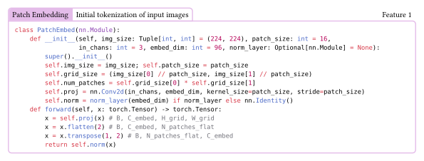
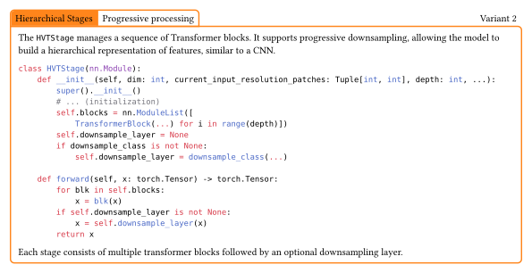
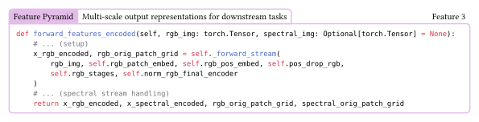
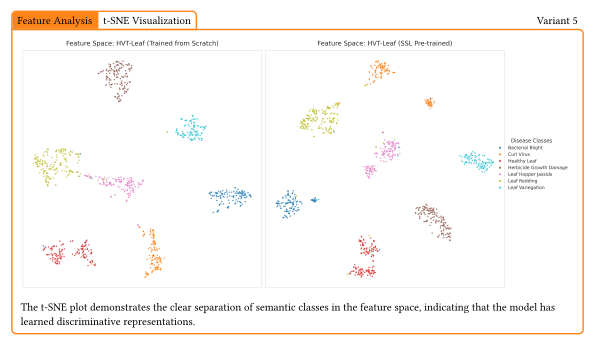
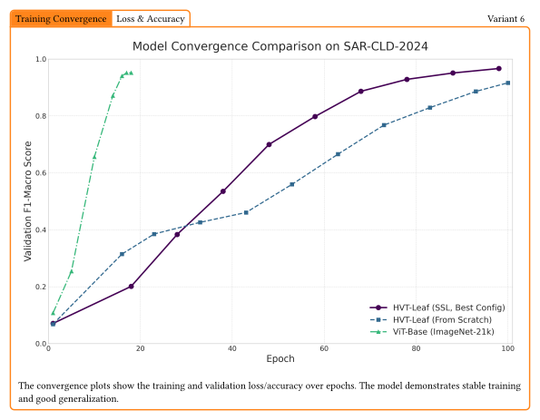
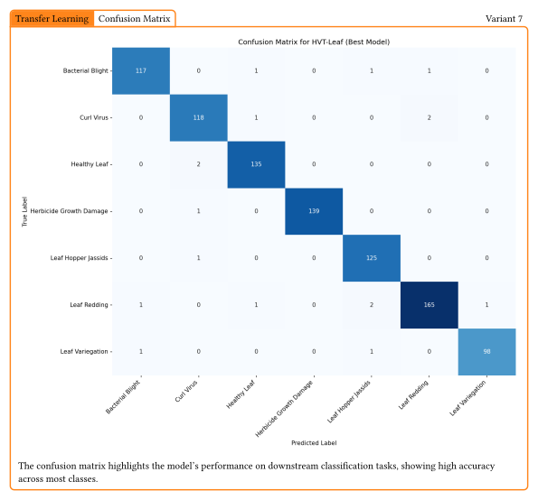
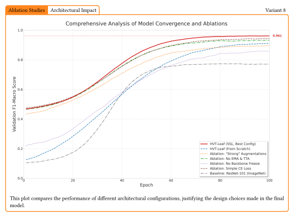

# Leaf Disease VIT - Hierarchical Vision Transformer

**Note: This repository contains the implementation of the Hierarchical Vision Transformer for leaf disease detection. It includes code for pre-training, fine-tuning, and analysis. This is an active research project.**

## Technical Architecture

The architecture follows a multi-stage design:

### 1. Patch Embedding
Initial tokenization of input images.

<picture>
  <source media="(prefers-color-scheme: dark)" srcset="assets/frame-dark-1.svg">
  
</picture>

### 2. Hierarchical Stages
Stacked transformer blocks with progressive downsampling.

<picture>
  <source media="(prefers-color-scheme: dark)" srcset="assets/frame-dark-2.svg">
  
</picture>

### 3. Feature Pyramid
Multi-scale output representations for downstream tasks.

<picture>
  <source media="(prefers-color-scheme: dark)" srcset="assets/frame-dark-3.svg">
  
</picture>

### 4. Efficiency Optimizations
Includes optimized attention mechanisms and memory-efficient implementation.

<picture>
  <source media="(prefers-color-scheme: dark)" srcset="assets/frame-dark-4.svg">
  
</picture>

## Installation
From the root of the repository, run:

```bash

git clone https://github.com/divital-coder/Leaf-Effects.git
cd Leaf-Effects
python -m venv venv
source venv/bin/activate
pip install -r requirements.txt

```

## Usage
The repository consists of several `experiments` (phases), each containing scripts to run specific stages of the pipeline:

- `phase3_pretraining` - Self-supervised learning (SSL) pre-training experiment.
- `phase4_finetuning` - Fine-tuning on downstream tasks.
- `phase5_analysis_and_ablation` - Analysis, visualization, and robustness testing.

### Run Experiments

You can run individual experiments using the scripts provided in each phase directory.

**Pre-training:**
```bash
cd phase3_pretraining && python run_ssl_pretraining.py
```

**Fine-tuning:**
```bash
cd phase4_finetuning && python main.py --config config.yaml
```

**Analysis:**
```bash
cd phase5_analysis_and_ablation && python analyze_best_model.py
```

### Model Comparison & Analysis

Use the analysis scripts to evaluate model performance and visualize features.

**Feature Analysis:**
```bash
python phase5_analysis_and_ablation/visualize_features.py
```

**Attention Analysis:**
```bash
python phase5_analysis_and_ablation/visualize_attention.py
```

## Results

### Feature Analysis
<picture>
  <source media="(prefers-color-scheme: dark)" srcset="assets/frame-dark-5.svg">
  
</picture>

### Training Convergence
<picture>
  <source media="(prefers-color-scheme: dark)" srcset="assets/frame-dark-6.svg">
  
</picture>

### Transfer Learning Performance
<picture>
  <source media="(prefers-color-scheme: dark)" srcset="assets/frame-dark-7.svg">
  
</picture>

### Ablation Studies
<picture>
  <source media="(prefers-color-scheme: dark)" srcset="assets/frame-dark-8.svg">
  
</picture>

### Attention Analysis
<picture>
  <source media="(prefers-color-scheme: dark)" srcset="assets/frame-dark-9.svg">
  
</picture>


**Note: Want to create a similar README.md? Follow the instructions in the [Typst Configuration Readme Rendering Commands](#typst-configuration-readme-rendering-commands) section.**

### Typst Configuration Readme Rendering Commands

There are various `make` commands that may be helpful.

```bash
make format  # Run black and isort
make lint    # Run flake8, mypy, black --check, and isort --check
make test    # Run tests
make clean   # Clean up cache files
make readme
```
